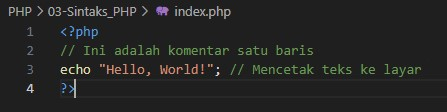

# Sintaks Dasar PHP

PHP menggunakan tag pembuka `<?php` dan tag penutup `?>`. Semua kode PHP harus ditulis dalam tag ini.



<b>Penjelasan:</b>

- <b>Tag Pembuka</b> `<?php`: Menandakan dimulainya kode PHP.
- <b>Tag Penutup</b> `?>`: Menandakan akhir dari kode PHP.
- <b>Komentar</b>: Gunakan `//` untuk komentar satu barus dan `/* ... */` untuk komentar multi-baris.

Untuk menyingkat penulisan `echo`, kita dapat mengganti tag pembuka-nya pada bagian tulisan PHP. Berikut contoh penerapan-nya.

```php
<?= "pengenalan materi PHP" ?>
```

kode diatas sama saja dengan kode berikut :

```php
<?php echo "pengenalan materi php"; ?>
```

Cukup simple karena kita menghilangkan tulisan `php` dan `echo`. Kode PHP sendiri sangatlah fleskbile karena dia bisa ditaruh dimana saja bahkan bisa digabung dengan tag HTML.