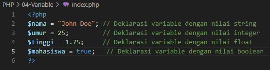

# Apa itu Variable

Variable adalah tempat untuk menyimpan data yang dapat berubah-ubah selama program dijalankan.

# Ciri-ciri dan Aturan Penamaan Variable

- Diawali dengan simbol `$` (misalnya: `$nama`).
- Harus dimulai dengan huruf atau underscore.
- Bersifat case-sensitive (`$nama` berbeda dengan `$Nama`).
- Tidak boleh mengandung spasi (`$nama lengkap`).
- Tidak boleh menggunakan karakter khusus kecuali underscore (`_`).
- Tidak boleh dimulai dengan angka (`$1nama`).

# Cara Mendeklarasikan Variable

<b>Penjelasan:</b>

- <b>$nama</b> menyimpan nilai berupa teks.
- <b>$umur</b> menyimpan nilai angka bulat.
- <b>$tinggi</b> menyimpan nilai angka desimal.
- <b>$mahasiswa</b> menyimpan nilai benar atau salah.