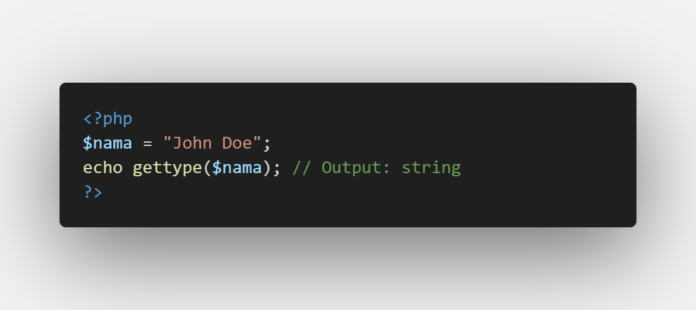
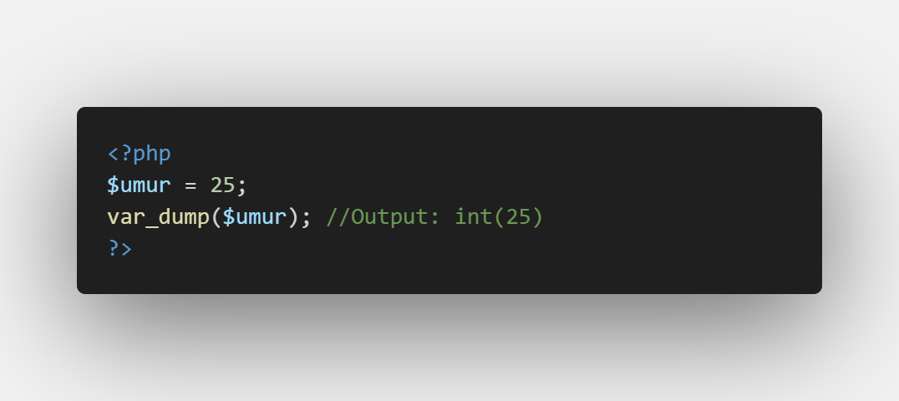
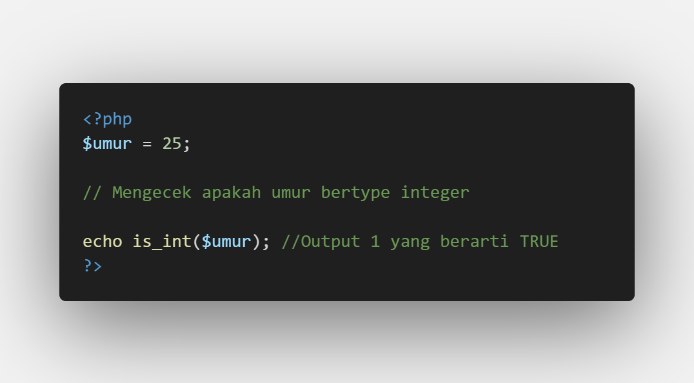

# Apa itu Tipe Data

Tipe Data adalah kategori atau jenis dari suatu nilai yang disimpan dalam variabel. yang menentukan bagaimana data tersebut diperlakukan oleh program.

# Tipe Data di PHP

- <b>String:</b> Menyimpan teks, contoh: `"Hello, World!"`
- <b>Integer:</b> Menyimpan bilangan bulat, contoh: `123`
- <b>Float (Double):</b>Menyimpan bilangan desimal, contoh: `3.14`
- <b>Boolean:</b> Menyimpan nilai benar/salah, contoh: `true` atau `false`
- <b>Array:</b> Menyimpan beebrapa nilai dalam satu variabel.
- <b>NULL:</b> Menyimpan variabel tanpa nilai.

# Cek Tipe Data di PHP

- Menggunakan `gettype()`: Mengembalikan tipe data dari variabel.

- Menggunakan `var_dump()`: Menampilkan tipe data dan nilai dari variabel.

- Menggunakan fungsi `is_*()`: Mengecek tipe data tertentu dengan kondisi.

