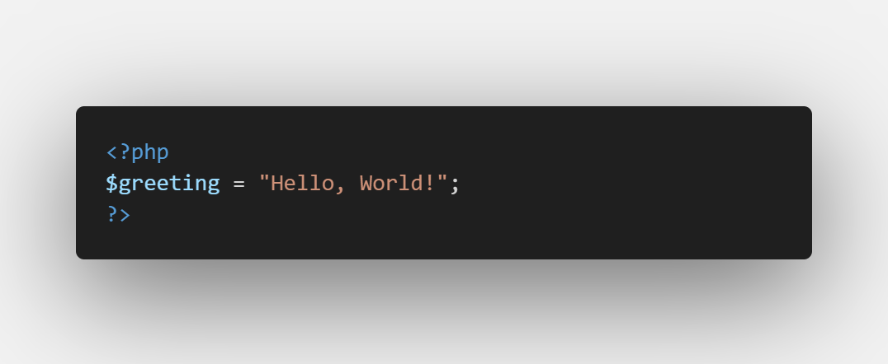
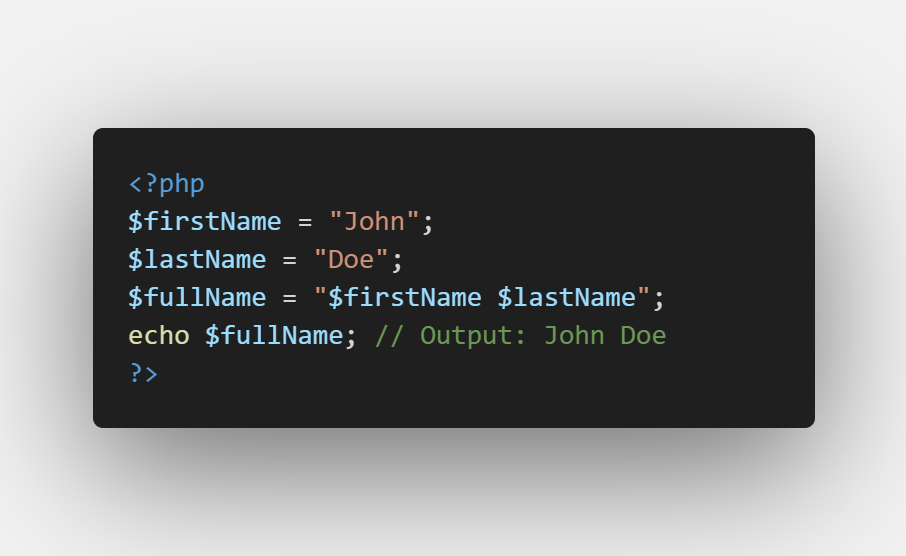
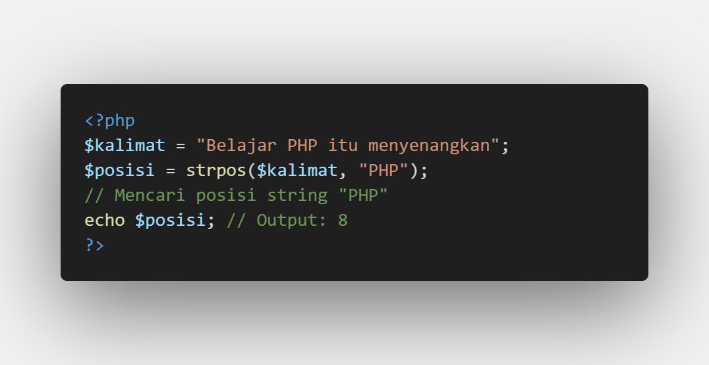
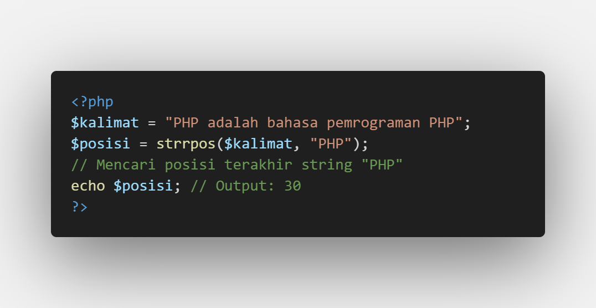
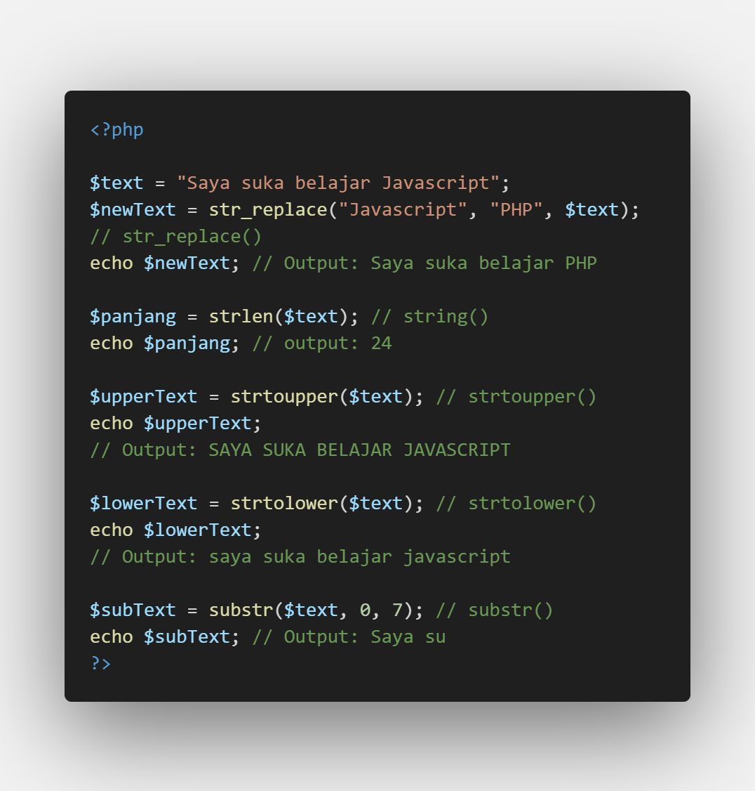

# Apa itu String

String adalah tipe data yang digunakan untuk menyimpan teks. Dalam PHP, string didefinisikan menggunakan tanda kutip tunggal `'` atau ganda `"`.

# Penggabungan String (Concatenation)

Penggabungan String adalah proses menggabungkan dua atau lebih string menjadi satu. Di PHP, penggabungan string bisa dilakukan dengan dua cara utama:

- Cara 1: Menggunakan Operator Titik (.)

> Penjelasan: Operator `.` digunakan untuk menggabungkan `$firstName` dengan `$lastName`, dengan menambahkan spasi di antaranya.

- Cara 2: Menggunakan Interpolasi String dengan Tanda Kutip Ganda (`"`)

> Penjelasan: Dalam Interpolasi string, variabel dapat langsung disisipkan di dalam string dengan tanda kutip ganda (`"`). Interpolasi tidak berfungsi dengan tanda kutip tunggal(`'`). Jika menggunakan tanda kutip tunggal, variabel tidak akan diproses sebagai nilai.

# Pencarian String

Pencarian String adalah prosees menemukan posisi atau keberadaan substring di dalam string utama. PHP menyediakan beberapa fungsi pencarian, seperti `strpos()` dan `strrpos()`.

Cara 1: Menggunakan `strpos()`

> Penjelasan: `strpos()` mencari posisi substring "PHP" di dalam `$kalimat` dan mengembalikan posisi pertama yang ditemukan.

Cara 2: Menggunakan `strrpos()`

> Penjelasan: `strrpos()` mencari posisi terakhir substring "PHP" di dalam `$kalimat`.

# Fungsi String Lain Sering Digunakan

PHP memiliki berbagai fungsi untuk memanipulasi string, seperti mengganti, menghitung panjang, mengubah huruf besar/kecil, dan mengambil sebagian teks.

- `str_replace()`: Digunakan untuk mengganti substring tertentu dalam sebuah string.
- `strlen($string)`: Menghitung panjang string.
- `strtoupper($string)`: Mengubah seluruh huruf menjadi huruf besar.
- `substr($string, start, length)`: Mengambil sebagian string.

