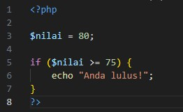
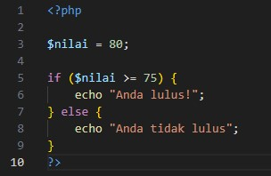
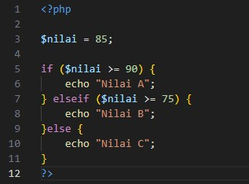
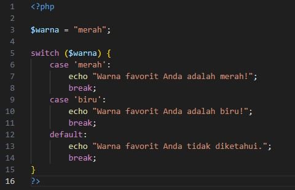

# Apa itu Struktur Kontrol?

Struktur Kontrol adalah bagian penting dari pemrograman yang memungkinkan pengembang untuk menontrol alur eksekusi kode berdasarkan kondisi tertentu. PHP mendukung berbagai struktur kontrol, seperti <b>conditional statements</b> dan <b>loops</b>, untuk mengatur bagaimana program berjalan.

# Conditional Statements

<b>Conditional statements</b> digunakan untuk melakukan tindakan tertentu berdasarkan kondisi tertentu. Ada beberapa jenis conditional statements di PHP.

- `if` Statement
- `else` Statement
- `else if` Statement
- `switch` Statement

## if Statement

Digunakan untuk mengeksekusi blok kode hanya jika kondisi yang diberikan bernilai `true`.

<b>Penjelasan:</b>

> Pada contoh di atas, pesan "Anda lulus!" akan ditampilkan hanya jika nilai variabel `$nilai` lebih besar atau sama dengan 75.

## else Statement

Digunakan bersama dengan `if` untuk mengeksekusi blok kode jika kondisi `if` bernilai `false`.

<b>Penjelasan:</b>

> Jika nilai variabel `$nilai` kurang dari 75, maka pesan "Anda tidak lulus" akan ditampilkan.

## elseif Statement

Digunakan untuk mengevaluasi beberapa kondisi berbeda.

<b>Penjelasan:</b>

> Pada contoh diatas, kondisi pertama memeriksa apakah nilai lebih besar atau sama dengan 90. Jika tidak, ia akan memeriksa kondisi `elseif` apakah nilai lebih besar atau sama dengan 75.

## switch Statement

Digunaakn untuk mengevaluasi kondisi berbeda.

<b>Penjelasan:</b>

> Pada contoh ini, jika nilai variabel `$warna` adalah merah, maka pesan <b>"Warna favorit Anda adalah merah!"</b> akan ditampilkan.