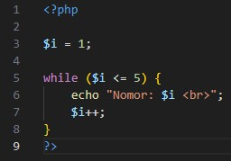
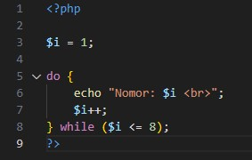
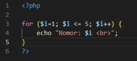
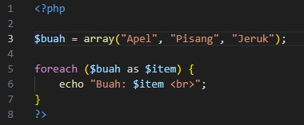
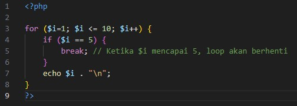
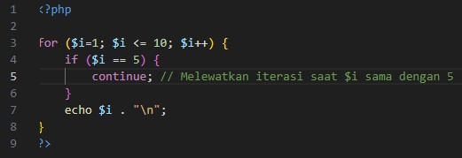

# Looping

<b>Looping</b> digunakan untuk mengeksekusi blok kode berulang kali selama kondisi tertentu terpenuhi. PHP emndukung beberapa jenis loop:

- <b>while</b> loop
- <b>do-while</b> loop
- <b>for</b> loop
- <b>foreach</b> loop
- <b>break</b>
- <b>continue</b>

## while Loop

Mengeksekusi blok kode selama kondisi tertentu bernilai `true`.

<b>Penjelasan:</b>

> Loop ini akan menampilkan angka 1 hingga 5 karena kondisi `$i <= 5` bernilai <b>true</b>.

## do-while Loop

Mirip dengan `while` loop, tetapi blok kode akan dieksekusi setidaknya sekali, bahkan jika kondisinya `false`.

<b>Penjelasan:</b>

> Pada contoh ini, kode di dalam blok `do` akan dijalankan setidaknya sekali sebelum memeriksa kondisi.

## for Loop

Digunakan ketika Anda tahu sebelumnya berapa kali loop perlu dijalankan.

<b>Penjelasan:</b>

> Loop ini akan dijalankan dari nilai 1 hingga 5.

## foreach Loop

Digunakan untuk mengulang setiap element dari array.

<b>Penjelasan:</b>

> Loop ini akan mengulang setiap elemen dalam array `$buah` dan menampilkan-nya.

## break dan continue

- `break` digunakan untuk menghentikan eksekusi loop secara langsung, sehingga alur program akan keluar dari loop yang sedang berjalan.

- `continue` digunakan untuk melewatkan sisa kode dalam loop pada iterasi tertentu dan langsung lemanjutkan ke iterasi berikutnya.

<b>contoh `break` dalam code</b>

<b>contoh `continue` dalam code</b>

