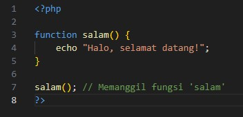
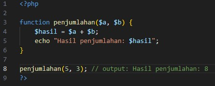
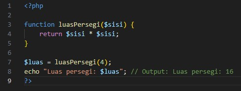

# Apa itu Fungsi

Fungsi adalah blok kode yang dirancang untuk melakukan tugas tertentu dan dapat dipanggil berulang kali dalam program. Penggunaan fungsi memudahkan pengelolaan kode, menghindari pengulangan, dan meningkatkan keterbacaan.

# Cara mendefinisikan Fungsi

- Di PHP, sebuah fungsi didefinisikan dengan menggunakan kata kunci `function`, diikuti dengan naam fungsi dan sepasang tanda kurung (). Setelah itu kode yang dijalankan dapat ditulis didalam `{}`.

- Untuk memanggil fungsi dapat menggunakan naam fungsi diikuti dengan ().

<b>Penjelasan:</b>

> Pada contoh diatas, fungsi `salam()` didefinisikan untuk mencetak "Halo, selamat datang!" dan dipanggil menggunakan nama fungsinya.

# Parameter dalam Fungsi

Parameter adalah variabel yang ditentukan didalam tanda kurung () saat mendefinisikan fungsi dan digunakan untuk menirma input saat fungsi dipanggil.

<b>Penjelasan</b>

> `penjumlahan()` memiliki dua parameter, `$a` dan `$b`, yang digunakan untuk menghitung hasil penjumlahan.

# Nilai Kembalian (Return)

`return` digunakan untuk mengembalikan nilai dari sebuah fungsi.

<b>Penjelasan:</b>

> Fungsi `luasPersegi()` mengembalikan hasil perhitungan luas persegi dan nilai ini kemudian dapat digunakan di luar fungsi.