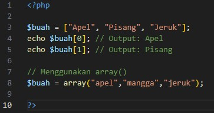
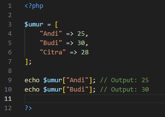
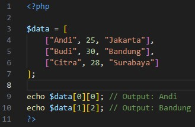
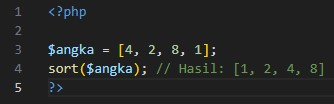
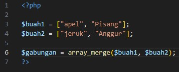
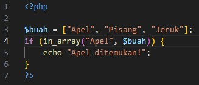

# Definisi Array

- Array adalah sebuah variabel yang dapat menyimpan lebih dari satu nilai dalam satu variabel. Ini sangat berguna jika Anda perlu mengelompokkan data yang terkait. Dalam PHP, array didefinisikan dengan tanda kurung siku `[]` atau fungsi `array()`.

- Untuk mengakses elemen di dalama array biasa (indeks numerik), kita menggunakan nomor indeks, Indeks dimulai dari <b>0</b>, bukan 1.

Pada contoh :

- Array menyimpan 3 nilai, yaitu "Apel", "Pisang", dan "Jeruk".
- `$buah[0]` akan mengakses elemen pertama yaitu "Apel".
- `$buah[1]` akan mengakses elemen kedua yaitu "Pisang".

# Array Asosiatif

- Array asosiatif adalah array yang menggunakan kunci (key) yang diatur secara manual, bukan indeks numerik. Kunci dapat berupa string atau angka.
- Dalam array asosiatif, kita menggunakan kunci (key) untuk mengakses nilai yang terkait dengan kunci tersebut.

Contoh Array Asosiatif:

Dalam contoh ini, "Andi", "Budi", dan "Citra" adalah kunci, dan 25, 30, serta 28 adalah nilai yang terkait dengan masing-masing kunci.

Pada contoh:
- `$umur["Andi"]` akan mengembalikan nilai 25.
- `$umur["Budi"]` akan mengembalikan nilai 30.

# Array Multidimensi

- Array multidimensi adalah array yang memiliki array di dalamanya. Ini bisa digunakan untuk menyimpan data dalam bentuk tabel atau struktur yang lebih kompleks.

- Untuk array multidimensi, kita menggunakan dua atau lebih indeks untuk mengakses elemen di dalamnya, Indeks pertama merujuk pada array utama, sedangkan indeks kedua merujuk pada elemen dalam array tersebut.

Contoh Array Multidimensi

Pada contoh:

- setiap elemen adalah array lain yang berisi data pribadi seperti nama, umur, dan kota asal.

- `$data[0][0]` mengakses elemen pertama dari array pertama, yaitu <b>"Andi"</b>.
- `$data[1][2]` mengakses elemen ketiga dari array kedua, yaitu <b>"Bandung"</b>.

# Fungsi-Fungsi Array

PHP menyediakan banyak fungsi untuk bekerja dengan array. Beberapa fungsi yang sering digunakan adalah:

- Sorting Array (`sort`), mengurutkan elemen array dalam urutan menaik.

- Menggabungkan Array (`array_merge`)

- Menghitung Jumlah Elemen (`count`)

- Mengecek Elemen di dalam Array (`in_array`)

